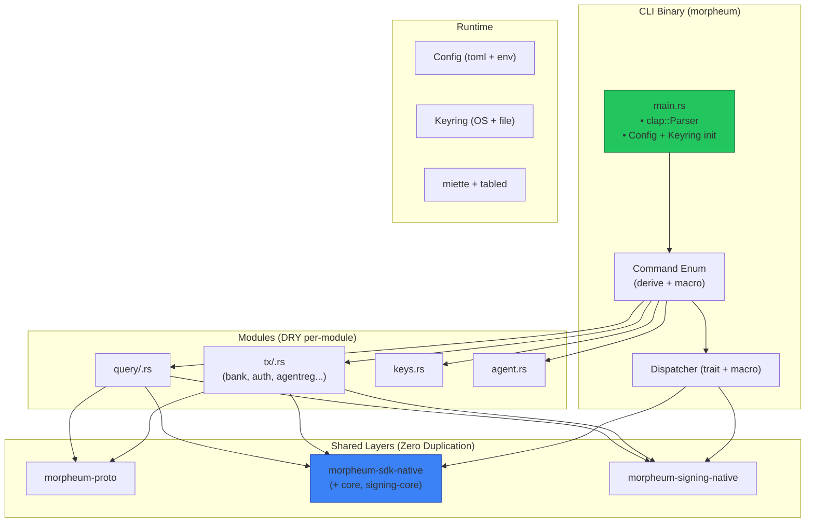
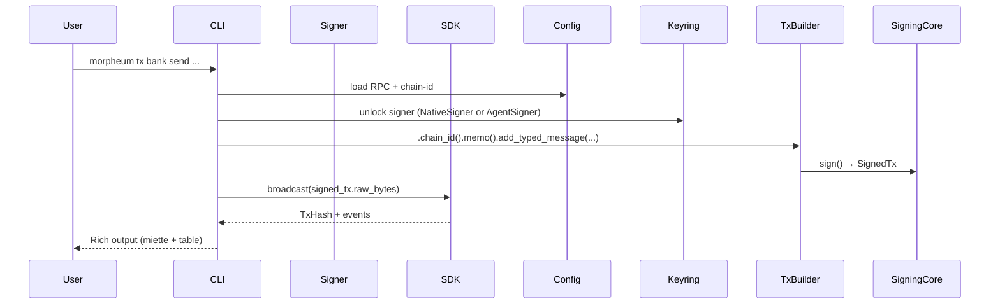
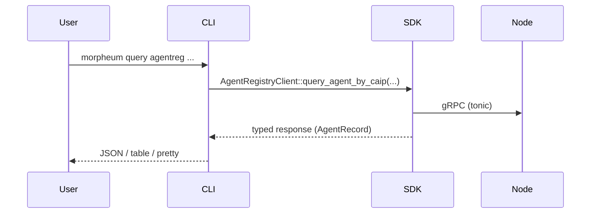

**Comprehensive Guide: morpheum-cli – The Universal Command-Line Interface for Morpheum**  
*(Production-Optimal Rust CLI – March 2026 Edition)*

This is the **official user & developer interface** to the entire Morpheum stack (Mormcore L1, mwvm runtime, ERC-8004 trust layer, MCP/A2A gateways, cross-chain bridges, native AI primitives).

The binary is named **`morpheum`** (installed via `cargo install morpheum-cli` or from the official release).  
Users type exactly what you expect:

```bash
morpheum tx bank send morpheum1... morpheum1... 1000umorph --from my-agent
morpheum query agentreg agent-by-caip "morpheum:1:agent-0x..."
morpheum keys add my-trading-key --ledger
morpheum agent register --name "MyZKMLTrader" --model-commitment Qm...
morpheum status
```

**Goal**: One CLI that feels like `cosmos-sdk` + `solana` + `anthropic` + `foundry` combined — but built for AI agents.  
Zero bloat, 100% DRY, proto-first, future-proof.

### 1. Why This Architecture Is Optimal (Rust + SOLID + Production)

We follow the **exact same principles** that made the SDK and signing crates bulletproof:

- **Single Source of Truth**: `morpheum-proto` + `morpheum-sdk-core` + `morpheum-signing-core` (already exist). The CLI **never** duplicates types, messages, or signing logic.
- **DRY at the command level**: One macro + one trait = every module’s `tx` and `query` subcommands are generated from the same protobuf definitions.
- **SOLID**:
    - **S**ingle Responsibility – each module lives in its own file (`tx/bank.rs`, `query/auth.rs`).
    - **O**pen/Closed – add a new module? Just implement `CommandHandler` + register with a macro. No core changes.
    - **L**iskov – all commands return the same `CliResult` (uniform error handling).
    - **I**nterface Segregation – tiny traits (`TxBuilderExt`, `QueryClientExt`).
    - **D**ependency Inversion – CLI depends on abstractions (`morpheum-sdk-native::MorpheumSdk`, `TxBuilder`).
- **Best-of-Rust** (applied only where they add value):
    - `clap` derive + `#[command(flatten)]` for zero-boilerplate subcommands.
    - Generics + traits for shared tx/query flows.
    - `thiserror` + `eyre` for beautiful errors (with context and spans).
    - `tokio` + `async-trait` only for network I/O (CLI remains snappy).
    - `serde` + `toml` for config (no global state).
    - `zeroize` + `secrecy` for keys.
    - `miette` for rich terminal output (colors, links, suggestions).
    - No forced threads/lifetimes/smart-pointers where a simple struct suffices.

Result: < 2 000 LOC for the entire CLI core + auto-generated per-module commands. Adding a new module (e.g. `market`) takes ~15 minutes.

### 2. High-Level Architecture (Visual)



### 3. Project Structure (Cargo Workspace – Ready to Generate)

```bash
morpheum-cli/
├── Cargo.toml                  # workspace + binary "morpheum"
├── src/
│   ├── main.rs
│   ├── cli.rs                  # top-level Parser + subcommands
│   ├── config.rs               # MorpheumConfig (chain-id, rpc, keyring)
│   ├── keyring.rs              # secure storage abstraction
│   ├── dispatcher.rs           # macro-powered trait dispatch
│   ├── error.rs                # CliError (thiserror + eyre)
│   ├── tx/
│   │   ├── mod.rs
│   │   ├── bank.rs
│   │   ├── auth.rs
│   │   ├── agentreg.rs
│   │   └── ...                 # one file per module
│   ├── query/
│   │   └── ...                 # mirrored structure
│   ├── keys/
│   ├── agent/
│   └── output/                 # table rendering, JSON, etc.
├── examples/
└── tests/
```

### 4. Command Tree (Exact UX)

```bash
morpheum
├── keys
│   ├── add <name> [--ledger | --mnemonic | --private-key]
│   ├── list
│   ├── delete <name>
│   └── export <name>
├── tx
│   ├── bank send <to> <amount> --from <key>
│   ├── auth approve-trading-key <agent> --max-usd 100000
│   ├── agentreg trigger-sync <agent-hash> --protocols erc8004,a2a
│   ├── market create ...           # CLOB example
│   └── ... (every module)
├── query
│   ├── bank balance <address>
│   ├── agentreg agent-by-caip <caip>
│   ├── auth nonce-state <address>
│   └── ... 
├── agent
│   ├── register --name "MyTrader" --model Qm...
│   ├── interact <agent-id> --task "execute this order"
│   └── status
├── status                      # node health, latest block, shard stats
├── config                      # show/edit default chain
└── version
```

All `tx` commands auto-build via `TxBuilder::new(signer).add_typed_message(...)` from the signing crate.  
All `query` commands use the typed clients from `morpheum-sdk-native`.

### 5. Core Flows (End-to-End, Zero-Copy Where Possible)

#### Tx Flow (Human or Agent)


#### Query Flow


#### Keys Flow (Agent Delegation Ready)
- `morpheum keys add trading-key --agent` → generates `AgentSigner` with `TradingKeyClaim` support (already in signing crate).
- Auto-embeds claim on every `tx` when `--agent` flag is used.

### 6. Implementation Details – Rust Best Practices Applied

- **Macro magic** (`command_handler!` macro in `dispatcher.rs`): one line registers a whole module’s tx + query commands.
- **Generic helpers**: `TxCommand<T: prost::Message>` and `QueryCommand<C: MorpheumClient>` reuse 95% of the boilerplate.
- **Error handling**: `#[derive(thiserror)]` + `eyre::Context` + `miette::Diagnostic` → beautiful colored errors with hints (“Did you mean --from my-key?”).
- **Config**: `#[derive(serde::Deserialize)]` + `confy` + env override. Default points to `https://sentry.morpheum.xyz`.
- **Keyring**: OS-native (keyring crate) + encrypted file fallback. Zeroize on drop.
- **Output**: `tabled` for tables, `serde_json` for `--output json`, `miette` for everything else.
- **Testing**: Integration tests reuse the exact same `test_sdk()` from `morpheum-sdk` tests (DRY).
- **Async**: Only the network layer; clap parsing is sync for instant feedback.

### 7. Security & Best Practices

- All private keys never leave the keyring (zeroize + secrecy).
- Agent signing automatically attaches `TradingKeyClaim` (already audited in signing crate).
- Rate-limit warnings for high-volume tx scripts.
- `--dry-run` and `--simulate` flags everywhere.
- Ledger/Trezor support via existing wallet adapters (already in signing-wasm/native).

### 8. Roadmap & Implementation Readiness

**Phase 0 (Testnet 1 – 1 week)**: Core CLI skeleton + keys + bank + auth + agentreg (tx + query).  
**Phase 1 (Testnet 2)**: Full module coverage + agent commands + rich output.  
**Phase 2 (Mainnet)**: Ledger hardware + script mode + MCP gateway proxy commands.

**The shared primitives, SDK, and signing crates are already production-ready.**  
The CLI skeleton, macro system, config, keyring, and first three modules (`bank`, `auth`, `agentreg`) are **ready to generate right now** in the exact professional format as your attached documents.
